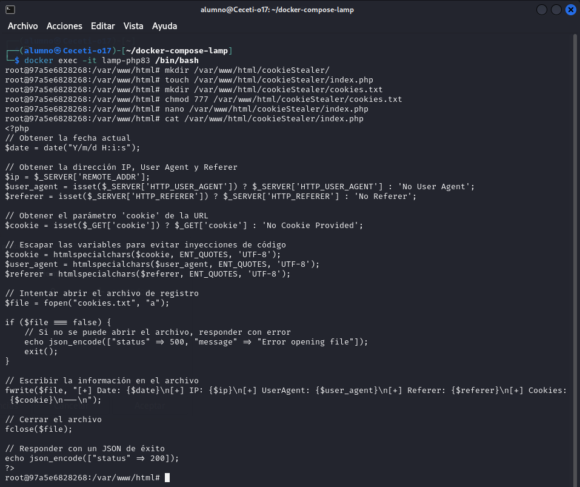
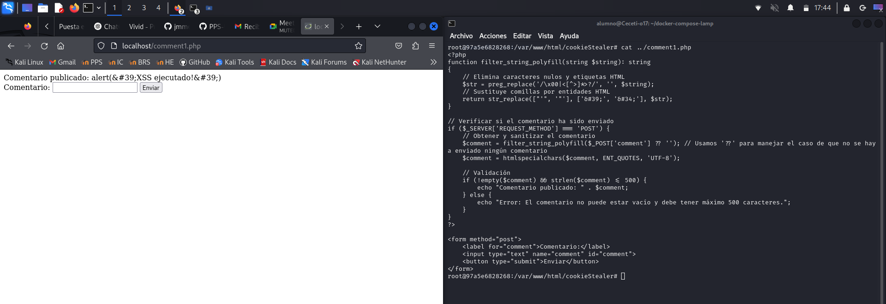
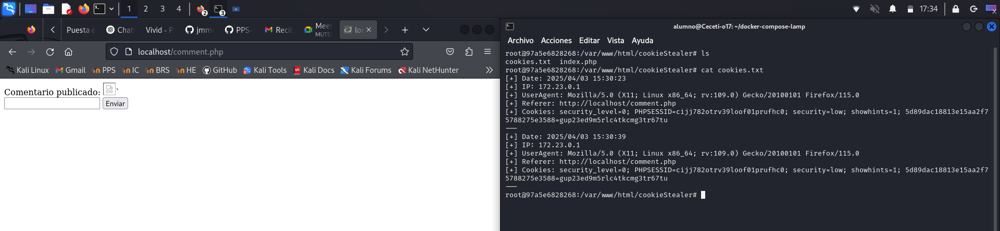
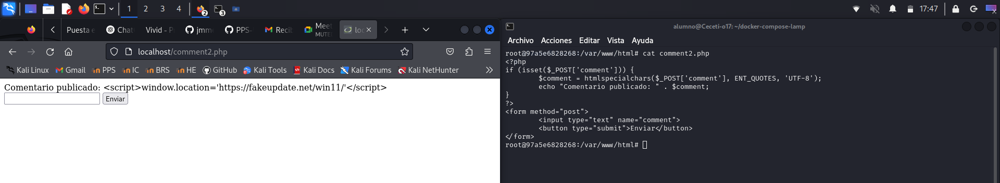
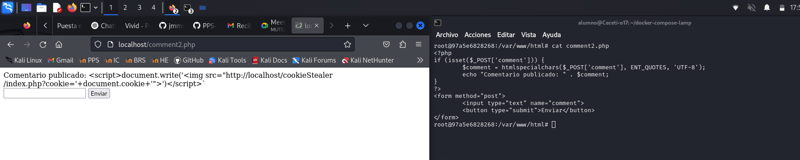

# PPS-Unidad3Actividad5-Angel
Explotación y Mitigación de Cross-Site Scripting (XSS)

Objetivos:

* Investigr cómo se pueden realizar ataques de Cross-Site Scripting (XSS)
* Conocer las diversas formas de ataque XSS
* Analizar el código de la aplicación que permite ataques de Cross-Site Scripting (XSS)
* Implementar diferentes modificaciones del código para aplicar mitigaciones o soluciones.

---

## ¿Qué es XSS?
Cross-Site Scripting (XSS) es una vulnerabilidad de seguridad en aplicaciones web que ocurre cuando un atacante inyecta código malicioso en una página web que no valida ni sanitiza scripts maliciosos y que se ejecutarán en el navegador de otros usuarios.

Tipos de XSS: 

* Reflejado: Se ejecuta al hacer la solicitud con un payload (desde la URL)
* Almacenado: El script se guarda en la base de datos y afecta a otros usuarios al acceder a la página.
* DOM-Based: El código malicioso se inyecta directamente en la estructura DOM del navegador sin que pase por el servidor.

---
## Actividades

* Lee detenidamente la sección de Cross-Site Scripting de la página de PortWigger <https://portswigger.net/web-security/cross-site-scripting>

* Lee el siguiente [documento sobre Explotación y Mitigación de ataques de Inyección SQL](./files/ExplotacionYMitigacionXSS.pdf) de Raúl Fuentes. Nos va a seguir de guía para aprender a explotar y mitigar ataques de inyección XSS Reflejado en nuestro entorno de pruebas.
 
* También y como marco de referencia, tienes [ la sección de correspondiente de ataque XSS reglejado de la **Proyecto Web Security Testing Guide** (WSTG) del proyecto **OWASP**.](https://owasp.org/www-project-web-security-testing-guide/stable/4-Web_Application_Security_Testing/07-Input_Validation_Testing/01-Testing_for_Reflected_Cross_Site_Scripting).

--- 
### Levantamos la máquina

### Código vulnerable

Creamos un archivo llamado comment.php en /www/

~~~
<?php
if (isset($_POST['comment'])) {
	echo "Comentario publicado: " . $_POST['comment'];
}
?>
<form method="post">
	<input type="text" name="comment">
	<button type="submit">Enviar</button>
</form>
~~~

El código malicioso anterior muestra un formuladio donde el usuario puede introducir comentarios en un campo de texto.
En el momento en que el usuario envía el formulario, el comentario introducido se muestra por pantalla con el siguiente mensaje: "Comentario publicado: \[comentario\]". 

El Código no sanitiza la entrada del usuario, lo que permite inyectar scripts maliciosos.

### **Explotación de XSS**
---

Abrir el navegador y acceder a la aplicación: <http://localhost/comment.php>

** Explotación 1**
Ingresar el siguiente código en el formulario:

~~~

~~~

Si aparece un mensaje de alerta (alert()) en el navegador, significa que la aplicación es vulnerable.

**Explotación 2**

Podríamos redirigir a una página de phishing:

``

**Capturar cookies del usuario (en ataques reales):**
---
Con este ataque, un atacante podría robar sesiones de usuarios.

- Primero preparamos el **servidor atacante**:

En el caso de que estés utilizando la máquina docker de la pila LAMP, recuerda que tienes que conectarte al servicio docker  php83 primero:
~~~
docker exec -it lamp-php83 /bin/bash
~~~

Crea en tu servidor web una carpeta con nombre cookieStealer y carpetas asociadas:
~~~
mkdir /var/www/html/cookieStealer/
touch /var/www/html/cookieStealer/index.php
touch /var/www/html/cookieStealer/cookies.txt
chmod 777 /var/www/html/cookieStealer/cookies.txt
~~~
 
> Si estamos con la Pila LAMP también lo podemos hacer directamente en la ruta _./www/cookieStealer_

Copia en el archivo coockieStealer/index.php [este archivo php](files/steal.php)
 - Ataque: Si insertamos en el comentario el siguiente script
~~~
`
~~~

En el archivo **cookie.txt** del servidor del atacante se habrán guardado los datos de nuestra cookie:

Puedes investigar más en <https://github.com/TheWation/PhpCookieStealer/tree/master>

## **Mitigación**
---
**Uso de filter_input() para filtrar caracteres.**
---
Filtra caracteres problemáticos.

Crea el documento comment1.php con el siguiente contenido:

~~~
<?php
function filter_string_polyfill(string $string): string
{
    // Elimina caracteres nulos y etiquetas HTML
    $str = preg_replace('/\x00|<[^>]*>?/', '', $string);
    // Sustituye comillas por entidades HTML
    return str_replace(["'", '"'], ['&#39;', '&#34;'], $str);
}

// Verificar si el comentario ha sido enviado
if ($_SERVER['REQUEST_METHOD'] === 'POST') {
    // Obtener y sanitizar el comentario
    $comment = filter_string_polyfill($_POST['comment'] ?? ''); // Usamos '??' para manejar el caso de que no se haya enviado ningún comentario
}
?>

<form method="post">
    <label for="comment">Comentario:</label>
    <input type="text" name="comment" id="comment">
    <button type="submit">Enviar</button>
</form>
~~~

La función que hemos creado al principio del documento: filter_string_polyfill nos va a eliminar todos los caracteres peligrosos y nos cambia caracteres conflictivos.

**Sanitizar la entrada con htmlspecialchars()**
---
htmlspecialchars() convierte caracteres especiales en sus equivalentes entidades HTML. Esto garantiza que incluso si el usuario ingresa una cadena que contiene etiquetas o código HTML, se mostrará como texto sin formato en lugar de que el navegador lo ejecute.
- <script> → &lt;script&gt;
- " → &quot;
- ' → &#39;

Con esta corrección, el intento de inyección de JavaScript se mostrará como texto en lugar de ejecutarse.

Crea un archivo comment2.php con el siguiente contenido 

~~~
<?php
if (isset($_POST['comment'])) {
        // para manejar el caso de que no se haya enviado ningún comentario
    // htmlspecialchars convierte caracteres especiales en equivalentes html
    $comment = htmlspecialchars($comment, ENT_QUOTES, 'UTF-8');

}
?>
<form method="post">
	<input type="text" name="comment">
	<button type="submit">Enviar</button>
</form>
~~~

Aunque usar htmlspecialchars() es una buena medida para prevenir ataques XSS, todavía se puede mejorar la
seguridad y funcionalidad del código con los siguientes puntos:

**Validación de entrada**
---

Actualmente, el código permite que el usuario envíe cualquier contenido, incluyendo texto vacío o datos
demasiado largos. Puedes agregar validaciones para asegurarte de que el comentario sea adecuado:

Crea un archivo comment3.php con el siguiente contenido:
~~~
<?php
//sanitizar comentario
$comment = htmlspecialchars($_POST['comment'], ENT_QUOTES, 'UTF-8');
if (!empty($comment) && strlen($comment) <= 500) {
        echo "Comentario publicado: " . $comment;
} else {
        echo "Error: El comentario no puede estar vacío y debe tener máximo 500caracteres.";
}
?>

<form method="post">
        <input type="text" name="comment">
        <button type="submit">Enviar</button>
</form>
~~~

Evita comentarios vacíos o excesivamente largos (500 caracteres).

**Protección contra inyecciones HTML y JS (XSS)**
---
Si bien htmlspecialchars() mitiga la ejecución de scripts en el navegador, se puede reforzar con strip_tags() si
solo se quiere texto sin etiquetas HTML:

`$comment = strip_tags($_POST['comment']);`

Elimina etiquetas HTML completamente. Útil si no quieres permitir texto enriquecido (bold, italic, etc.).

Si en cambio si se quiere permitir algunas etiquetas (por ejemplo, \<b\> y \<i\>), se puede hacer:

`$comment = strip_tags($_POST['comment'], '<b><i>');`

**Protección contra ataques CSRF**
---
Actualmente, cualquiera podría enviar comentarios en el formulario con una solicitud falsa desde otro sitio web.

Para prevenir esto, se puede generar un token CSRF y verificarlo antes de procesar el comentario.

En la [proxima actividad sobre ataques CSRF](https://github.com/jmmedinac03vjp/PPS-Unidad3Actividad6-CSRF) lo veremos más detenidamente.

_Generar y almacenar el token en la sesión_
~~~
session_start();
if (!isset($_SESSION['csrf_token'])) {
$_SESSION['csrf_token'] = bin2hex(random_bytes(32));
}
~~~

_Agregar el token al formulario_
`<input type="hidden" name="csrf_token" value="<?php echo $_SESSION['csrf_token']; ?>">`

_Verificar el token antes de procesar el comentario_
~~~
if (!isset($_POST['csrf_token']) || $_POST['csrf_token'] !== $_SESSION['csrf_token'])
{
die("Error: Token CSRF inválido.");
}
~~~
Estas modificaciones previenen ataques de falsificación de solicitudes (CSRF).

## Código Seguro

Crea el archivo comment4.php con todas las mitigaciones. La mitigaciones con mejoras para evitar CSRF las veremos en la siguiente actividad.

~~~
<?php
function filter_string_polyfill(string $string): string
{
    // Elimina caracteres nulos y etiquetas HTML
    $str = preg_replace('/\x00|<[^>]*>?/', '', $string);
    // Sustituye comillas por entidades HTML
    return str_replace(["'", '"'], ['&#39;', '&#34;'], $str);
}
session_start();
// Generar token CSRF si no existe
if (!isset($_SESSION['csrf_token'])) {
        $_SESSION['csrf_token'] = bin2hex(random_bytes(32));
}
if ($_SERVER["REQUEST_METHOD"] == "POST") {
        // Verificar el token CSRF
        if (!isset($_POST['csrf_token']) || $_POST['csrf_token'] !==$_SESSION['csrf_token']) {
                die("Error: Token CSRF inválido.");
        }// Verificar si el comentario ha sido enviado
        // Obtener y sanitizar el comentario
        $comment = filter_string_polyfill($_POST['comment'] ?? ''); // Usamos '??' para manejar el caso de que no se haya enviado ningún comentario
        $comment = htmlspecialchars($comment, ENT_QUOTES, 'UTF-8');
    // Validación de longitud y evitar comentarios vacíos.
    if (!empty($comment) && strlen($comment) <= 500) {
        echo "Comentario publicado: " . $comment;
    } else {
        echo "Error: El comentario no puede estar vacío y debe tener máximo 500 caracteres.";
    }
}
?>

<!DOCTYPE html>
<html lang="es">
<head>
        <meta charset="UTF-8">
        <meta name="viewport" content="width=device-width, initial-scale=1.0">
        <title>Comentarios Seguros</title>
</head>
<body>
        <form method="post">
                <label for="comment">Escribe tu comentario:</label>
                <input type="text" name="comment" id="comment" required maxlength="500">
                <input type="hidden" name="csrf_token" value="<?php echo
$_SESSION['csrf_token']; ?>">
                <button type="submit">Enviar</button>
        </form>
</body>
</html>
~~~

Aquí está el código securizado:

Medidas de seguridad implementadas

1. Eliminación de etiquetas HTML y caracteres nulos:

La función filter_string_polyfill() usa preg_replace('/\x00|<[^>]*>?/', '', $string); para eliminar caracteres nulos (\x00) y cualquier etiqueta HTML (<[^>]*>?). Esto reduce la posibilidad de inyección de scripts.

2. Escapado de comillas:

En filter_string_polyfill(), las comillas simples (') y dobles (") se reemplazan por sus equivalentes en entidades HTML (&#39; y &#34;). Esto evita el cierre prematuro de atributos en HTML.

3. Uso de htmlspecialchars:

Después de aplicar filter_string_polyfill(), se vuelve a ejecutar htmlspecialchars($comment, ENT_QUOTES, 'UTF-8');, lo que convierte caracteres especiales en entidades HTML.

	- ENT_QUOTES protege contra XSS al convertir tanto comillas simples como dobles en sus versiones seguras (&#39; y &#34;).

	- UTF-8 previene ataques basados en codificaciones incorrectas.  

4. Validación de longitud y contenido:

Se valida que el comentario no esté vacío y que no supere los 500 caracteres. Aunque esto no previene directamente XSS, ayuda a limitar intentos de ataques masivos.

